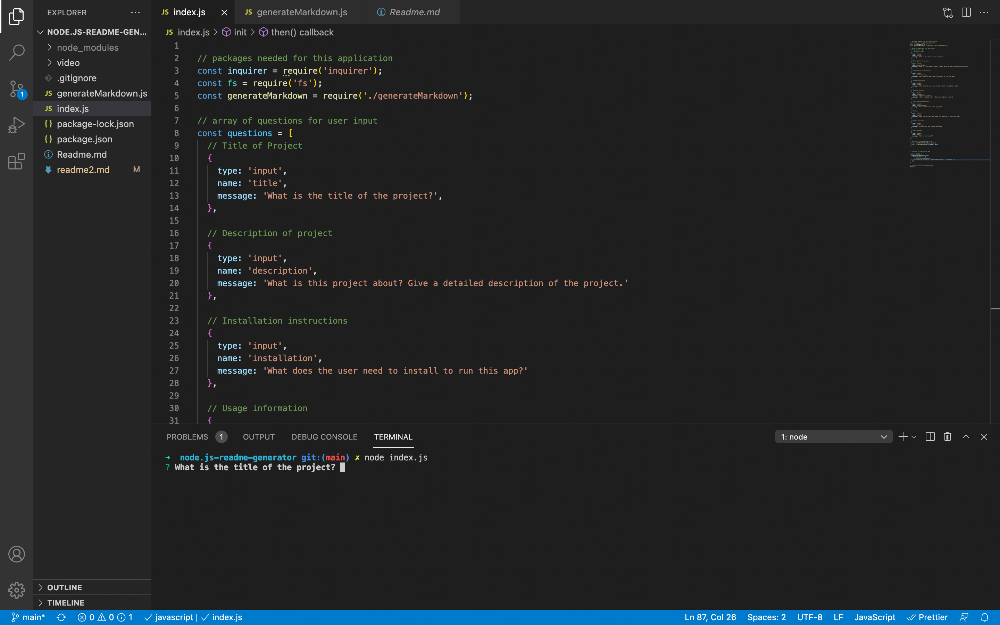
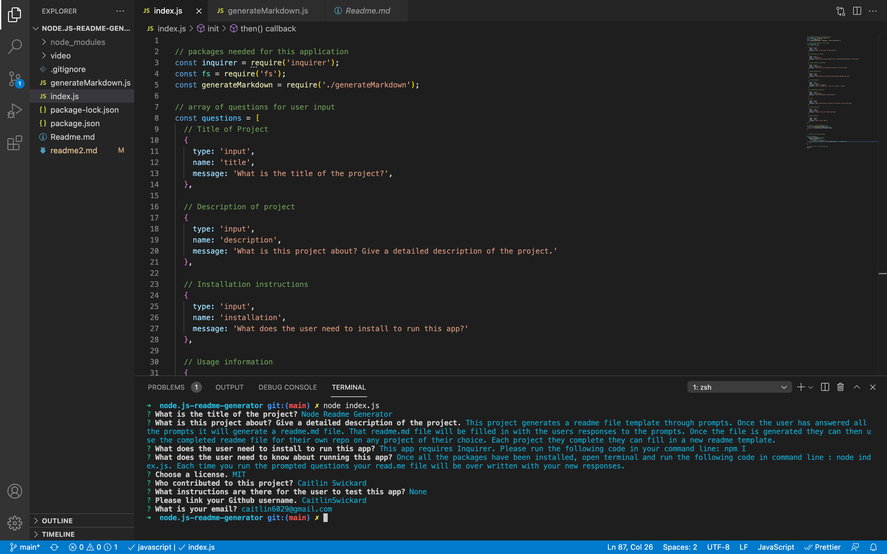

# Node.js Quality Readme Generator

This project is a command-line application that dynamically generates a professional README.md file from a user's input using the Inquirer package. You can quickly and easily create a README file by using this application. This allows a project creator to devote more time to working on the project. 

  * [Installation](#install)
  * [Usage](#usage)
  * For a video on using the app click [here.]()

## Criteria

- GIVEN a command-line application that accepts user input
- WHEN I am prompted for information about my application repository
- THEN a high-quality, professional README.md is generated with the title of my project and sections entitled Description, Table of Contents, Installation, Usage, License, Contributing, Tests, and Questions
- WHEN I enter my project title
- THEN this is displayed as the title of the README
- WHEN I enter a description, installation instructions, usage information, contribution guidelines, and test instructions
- THEN this information is added to the sections of the README entitled Description, Installation, Usage, Contributing, and Tests
- WHEN I choose a license for my application from a list of options
- THEN a badge for that license is added near the top of the README and a notice is added to the section of the README entitled License that explains which license the application is covered under
- WHEN I enter my GitHub username
- THEN this is added to the section of the README entitled Questions, with a link to my GitHub profile
- WHEN I enter my email address
- THEN this is added to the section of the README entitled Questions, with instructions on how to reach me with additional questions
- WHEN I click on the links in the Table of Contents
- THEN I am taken to the corresponding section of the README

## Install

Run npm i in terminal to install all the needed packages to run this app.

## Usage

Once all the packages have been installed, open terminal and run the following code in command line : node index.js. Each time you run the prompted questions your read.me file will be over written with your new responses.

## Built With

- JavaScript
- Node.js

## Screen shots

